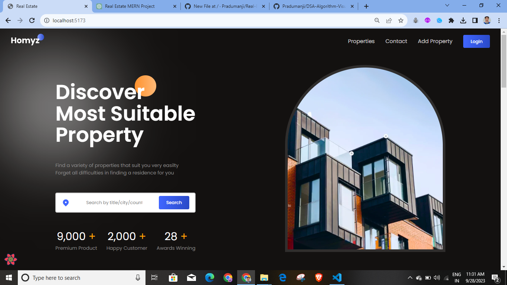
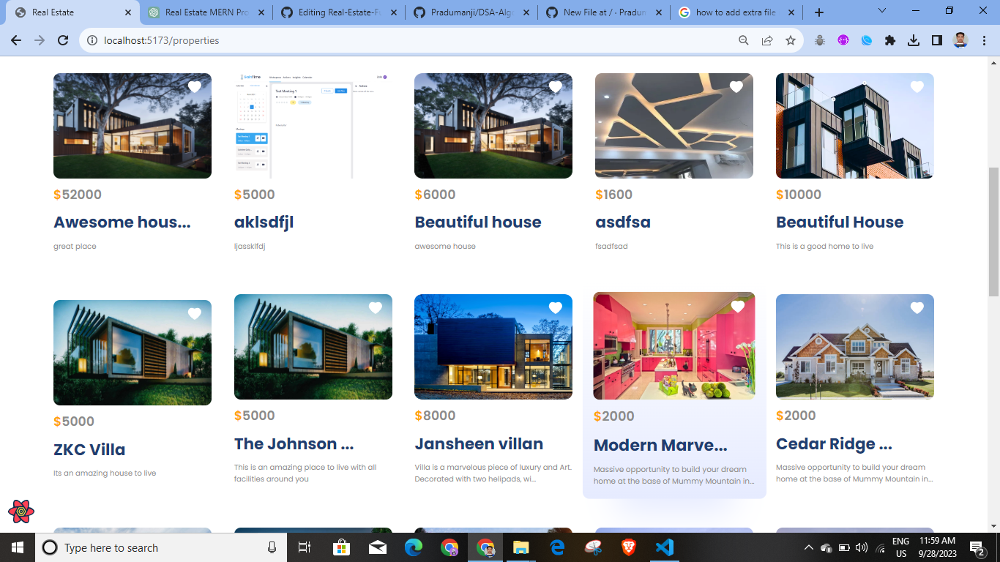
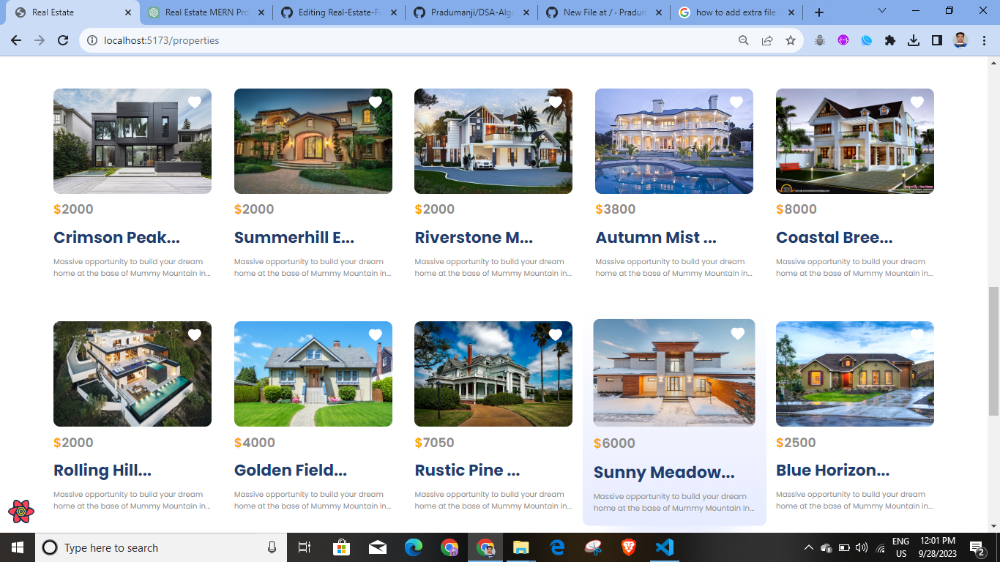
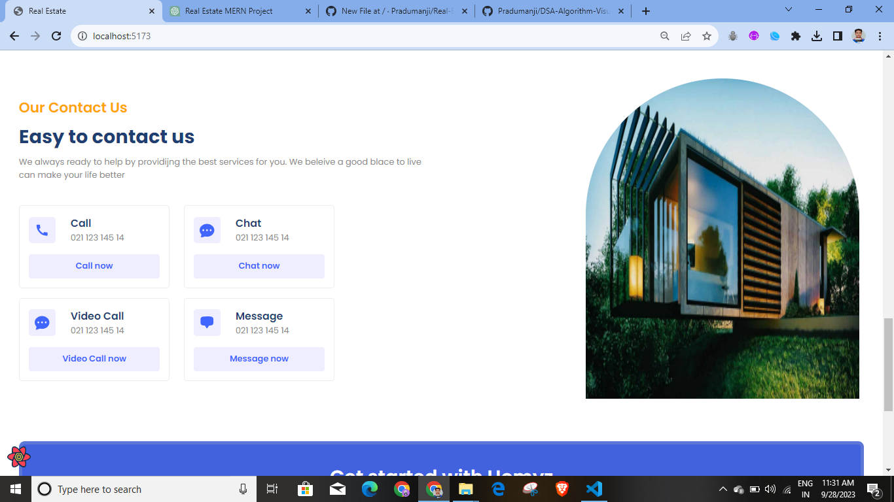
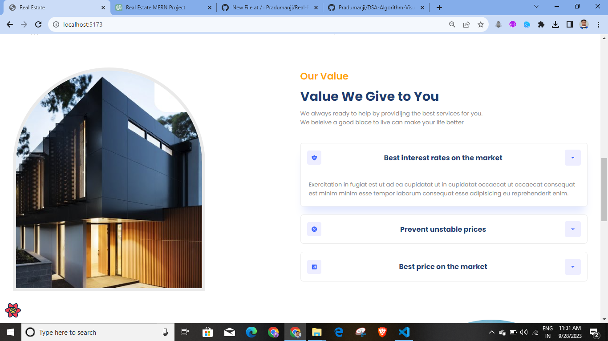
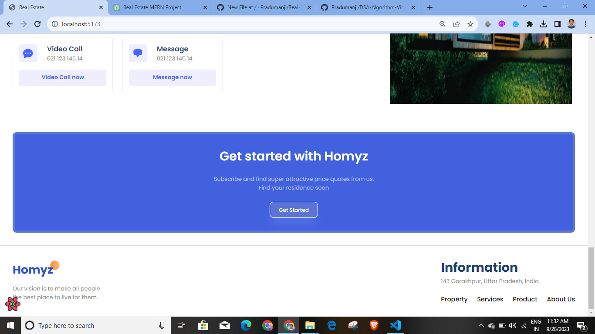

# Real-Estate-Full-Stack
### Project Screenshot

## Introduction
This is a full-stack Real Estate web application built using the MERN stack (MongoDB, Express.js, React, Node.js). The project is designed to provide a comprehensive platform for real estate agents, buyers, and sellers to interact, list properties, search for properties, and manage their real estate transactions seamlessly.

###  Features
1. User Authentication
User registration and login functionality with secure password hashing.
User roles: Admin, Real Estate Agent, Buyer, Seller.
Access control based on user roles.
2. Property Listing
Real estate agents and sellers can list properties with detailed information, including images, location, price, and features.
Property approval system (admin approval for listings).
Property search functionality with filters (location, price, type, etc.).
3. User Dashboard
Personalized dashboards for each user role.
Real estate agents can manage their listings and clients.
Buyers and sellers can track their transactions and property inquiries.
4. Property Inquiries and Transactions
Buyers can inquire about properties and communicate with real estate agents.
Secure transaction management system with documentation upload.
Admin oversight of transactions for added security.
5. Real-time Notifications
Notifications for new property listings, inquiries, and transaction updates.
Websockets or Push Notifications for instant alerts.
6. Maps Integration
Google Maps integration for property location visualization.
Directions and nearby amenities on property detail pages.
7. Responsive Design
Mobile-friendly UI for a seamless user experience on all devices.
##  Tech Stack
Frontend: React, Redux for state management, React Router for routing.
Backend: Node.js, Express.js, JWT for authentication.
Database: MongoDB for storing property and user data.
Other Tools: Socket.io for real-time updates, Google Maps API for mapping.
##  Installation and Usage
Clone the repository.
Navigate to the client and server folders and run npm install to install dependencies.
Set up your MongoDB database and configure the database connection in the server.
Create a .env file in the server folder for environment variables (e.g., JWT secret).
Run npm start in both the client and server folders to start the development server.
